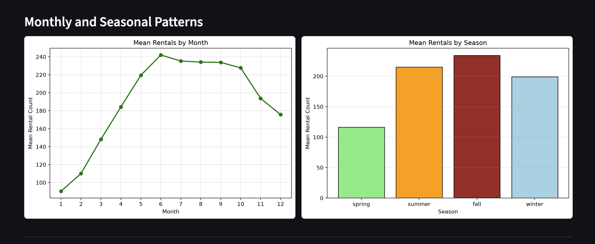

# Washington D.C. Bike Rental Analysis Dashboard

An interactive Streamlit dashboard exploring when bike rentals occur and how demand varies with season, weather, and temperature in Washington D.C. during 2011–2012.

**[Live dashboard](https://bike-rental-dashboard-xdlcrwknhnc5dp8vr9qnmz.streamlit.app/)** 

## Project overview

This project analyses hourly rental records from the Capital Bikeshare system to explore three questions:

- When is rental demand highest throughout the day and year?
- How does average demand differ between working and non-working days?
- How do weather conditions and temperature relate to rental activity?

The dashboard combines summary metrics, interactive filters, and six visualisations to make these patterns easier to explore.

## Dashboard features

### Interactive filters

Explore the data using three filters:

- Year: 2011, 2012, or both years.
- Season: select one or more seasonal categories.
- Day type: all days, working days, or non-working days.

### Summary metrics

The dashboard displays:

- Total rentals.
- Average rentals per hourly observation.
- Rentals by casual users.
- Rentals by registered users.

Casual and registered figures represent rental counts, not unique individuals.

### Visualisations

Six charts show different aspects of rental demand:

1. Average rentals by hour of day.
2. Average rentals by time period: night, morning, afternoon, and evening.
3. Average hourly rentals by month.
4. Average hourly rentals by seasonal category.
5. Average hourly rentals by weather condition.
6. Hourly rental counts plotted against temperature.

## Key findings

The following findings describe the dashboard view with both years,
all seasons, and all day types selected.

### Registered users account for most rentals

The displayed data contains 2,085,476 rentals:
1,693,341 by registered users and 392,135 by casual users.

Registered users account for approximately 81.2% of rentals,
compared with 18.8% for casual users.

### Demand peaks at 17:00

Average hourly rentals reach approximately 470 at 17:00.
A second peak occurs around 08:00, at approximately 360 rentals.

These peaks are consistent with a commuting-related pattern,
although the charts do not establish individual trip purposes.

### Afternoon has the highest average demand

The afternoon category averages approximately 300 rentals per
hourly observation, followed by evening at approximately 230
and morning at approximately 210.

Night has the lowest average, at approximately 25 rentals.

### Monthly demand rises into June

Average hourly rentals increase from approximately 90 in January
to approximately 242 in June.

Demand remains relatively high from July through October before
declining in November and December.

### The category labelled “fall” has the highest average

The displayed seasonal chart ranks fall highest, at approximately
234 rentals per hourly observation, followed by summer, winter,
and spring.

The interpretation of these categories depends on the dataset's
season coding and the labels used in the application.

### Working and non-working days have similar overall averages

Working days average 193 rentals per hourly observation,
compared with 189 on non-working days.

The difference is approximately 2%, indicating that overall
averages are similar. This comparison alone does not show whether
the timing of demand differs between the two day types.

### Clear weather is associated with higher average demand

Clear conditions average approximately 205 rentals per hourly
observation, compared with approximately 179 in mist,
118 in light rain or snow, and 164 in heavy rain.

These are descriptive comparisons, not evidence of causation.
Weather-category sample sizes are needed to assess how reliable
each average is.

### Temperature shows a broad relationship with demand

Higher rental counts appear more frequently at moderate-to-warm
temperatures than at very low temperatures.

However, rental counts vary widely at the same temperature,
showing that temperature alone does not explain demand.

## Interpretation notes

- Chart values quoted above are approximate readings from the dashboard.
- Monthly and seasonal charts show average hourly rentals, not total rentals for each month or season.
- Rental counts should not be interpreted as counts of unique users.
- Associations with weather and temperature do not establish causal effects.
- Weather-category comparisons should be interpreted alongside observation counts.
- Seasonal labels should be checked against the source data's coding.
- The displayed data covers 2011–2012 and should not be treated as a description of current demand.

## Data source

Hourly Washington D.C. bike rental data from the Capital Bikeshare
system, covering 2011–2012.
